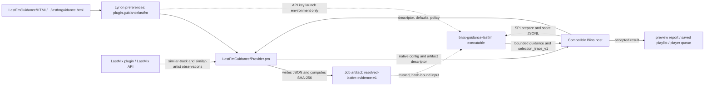
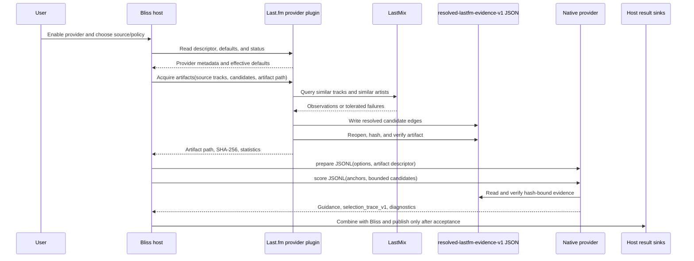

# Bliss Guidance: Last.fm

`lms-guidance-lastfm` is an independently installable, passive Lyrion guidance
provider in the **Bliss Guidance** family. It contributes bounded Last.fm
similar-track and similar-artist evidence when a compatible Bliss host invokes
it. It does not create mixes, reorder tracks, or control playback by itself;
another plugin must discover, enable, and use it.

## How it works

Choose one provider-owned source on its settings page:

- **LastMix** uses the installed LastMix plugin and remains unavailable until that plugin is installed.
- **API Key** is the settings and secret-handling surface for the planned
  direct-acquisition path. The released native provider does not yet perform
  Last.fm HTTP/cache acquisition in this mode, so it currently contributes
  neutral guidance. The key is passed only through the child process
  environment; it never enters request JSON, artifacts, logs, or preview
  results.

The currently working end-to-end path is **LastMix**: LastMix obtains the
observations, the host resolves them to the frozen local candidate inventory,
and the native provider consumes the resulting artifact. Direct API-key
acquisition remains a provider follow-up; the current settings and data-flow
limitations are described above.

Hosts discover the provider automatically but default it to disabled. Their
provider settings use these defaults unless a host explicitly overrides an
eligible policy control.

The compatible host plugins currently include
[Better Call Bliss](https://github.com/chrober/lms-better-call-bliss) and
[Bliss Mixer Lab](https://github.com/chrober/lms-blissmixer-lab). Both discover
this provider but leave it disabled until you explicitly enable it.

The native implementation is
[`bliss-guidance-lastfm`](https://github.com/chrober/bliss-guidance-lastfm).
The native protocol is owned by
[`bliss-playlist-guidance-spi`](https://github.com/chrober/bliss-playlist-guidance-spi).
Provider conventions and UI rules are documented in
[`lms-bliss-guidance-provider-kit`](https://github.com/chrober/lms-bliss-guidance-provider-kit).

## Architecture

The provider-owned files and streams are:

- `LastFmGuidance/Plugin.pm` exposes the discoverable provider, while
  `LastFmGuidance/Settings.pm` registers its settings page.
- `LastFmGuidance/HTML/EN/plugins/LastFmGuidance/settings/lastfmguidance.html`
  renders that page; persisted values live in the Lyrion
  `plugin.guidancelastfm` preference namespace.
- `LastFmGuidance/Provider.pm` publishes the descriptor and defaults, resolves
  host/job overrides, calls LastMix in LastMix mode, and writes the temporary
  `resolved-lastfm-evidence-v1` JSON artifact supplied by the host. The host
  receives its path and SHA-256 and passes them to the native process.
- `bliss-guidance-lastfm` reads that artifact and the bounded candidate/context
  messages from SPI JSONL on stdin, then returns bounded guidance,
  `selection_trace_v1`, and diagnostics on stdout. There is no separate
  `prepare.options` file: native options are part of the SPI `prepare` message.
- The host consumes the response and is the only component that writes preview
  results, playlists, or player queues.

## Runtime flow

In **API Key** mode the provider exposes the key only as a child-process
environment variable. The released native path does not yet perform direct
Last.fm HTTP/cache acquisition, so no evidence artifact is created and that
mode currently contributes neutral guidance.

## Installation

Install **Bliss Guidance: Last.fm** through
[chrober's LMS Plugin Repository](https://github.com/chrober/lms-plugins), then
enable the provider in a compatible host. Install and configure LastMix
separately when you want to use the LastMix source.

Configure the source and provider-owned guidance defaults on the provider's
own settings page. Host documentation describes how to enable the provider and
optionally override those defaults for a particular host or job.
